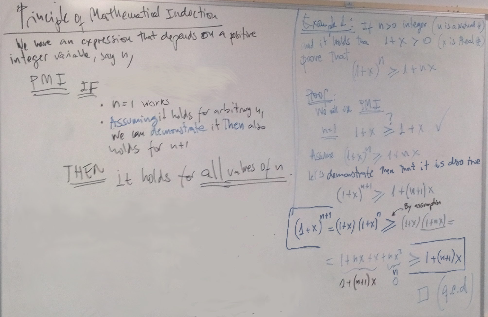

# Algorithms
## Preface
This notes combine concepts and discussions seeing in our G12 Comp.Sci. class 
with additional material
for exploring further details.

Not all in here is meant to be seeing in the course. Much less to be a material for a test.
The added content corresponds rather to an introductory undergrad level.

The combination of both the concepts from class plus these extensions will hopefully 
allow the student to gain an overview of what these topics lead to in more advanced, 
university-level courses. In this way, we hope to help bridge the gap and offer 
some continuity between 
end of High School and the following first year university.

Topics and discussions that are more advanced are denoted as such and have
a heading that starts with a $+$ sign.

\newpage
 
## Overview


An **algorithm** is a computational solution to a particular problem. This is what we
call a **program**.

### Programming and Mathematics
Algorithms are related to a type of logical reasoning, called 
**The Principle of Mathematical Induction** (PMI): We code algorithms in the same
way we demonstrate they are correct.

These demonstrations will lead to a recursive solution, which can be implemented as
a recursive function. Sometimes they may as well be transformed into a *closed form*
which is not recursive.

### Programming and Data Structures
Examples of **Abstract Data Types (ADT)** are *arrays, linked lists, dictionaries, queues, stacks, heaps,...*
They are defined  by the efficient methods available to deal with them: 
Retrieving, sorting, searching, inserting, deleting, etc.

### Data Structures are *abstract models* of the *world*
ADT's represent a model for an efficient solution to a particular problem. 

For instance, **arrays**: If we want to **quickly read or modify** all 100 elements of a set, we could
reserve space in memory for all of them and store each of them in a contiguous
memory location. Then we could provide a pointer to the first element. Retrieving
any element is very fast: say the 55Th element is at a memory address equal that of the first one
(stored in the pointer) plus 54 positions further up. No need to search nor do 
complicated operations. Addition is very fast.

However, if we want to add a new element, 101, we would need to create a new space for
101 elements somewhere else in memory, if we are not lucky to have location 101 free. 
Then copy the previous 100 elements to the new
location, and finally add the new element to it. 

Moving things around and accessing memory is *extremely slow when compared to the speeds
of the CPU*. 

*Deleting* an element is also costly. If we delete say element 55 we create a *hole*, a gap
in the array. Not all elements lie contiguous in memory now. We thus need to restore that
state of being all next to each other. If we don't then retrieving elements becomes 
complicated as we would need to take into account the holes created by all previous deletions.
But in order to restore order, we need to *move all elements from the 56Th to the 100Th one
position down in memory*. That's costly.

Thus, inserting and deleting elements to an array is costly. 
But an **array is a model of storing elements that is very efficient for retrieving
any element from a given set on a whim**.

Alternatively, if what we want is to **efficiently (quickly) add and remove** elements to and from a set,
we can use the model of a **linked list**. In this case we store each element wherever
we find space in memory. Thus elements will not be contiguous. 

Together with each element we also store the memory address (a pointer) of 
where the *next* element is stored. Finally we provide a pointer to the first element.

How do we insert efficiently an element into a linked list? Say you want to insert 5
at the 3rd position in a linked list composed of 1, 2, 3, 4. Store 5 anywhere in memory.
Then you make element 2 point
to wherever 5 is stored, and make 5 point to wherever *2 was initially pointing*!

Thus, **linked lists model a way of storing elements that is very efficient for inserting
and deleting elements**. 

However, retrieving say element 55 out of 100 is costly
because we have to start querying the first element for the location of the second,
this one for that of the third, and so on and so forth till we find where element 55
is located!

\newpage

## Introductory Examples:

The following are specific problems that exemplify the previous discussion.

1. Tower of Hanoi 
2. Slicing a Pizza with n cuts
     * Finite Series
3. Domino Effect
4. Josephus Problem

### The Tower of Hanoi 
)](https://upload.wikimedia.org/wikipedia/commons/0/07/Tower_of_Hanoi.jpeg)

In the Tower of Hanoi we are given the following problem. A set of 8 disks are piled up
through a rod sorted from largest, at the bottom, to smallest at the top. Two other empty
rods are available (see picture). We are asked to change the pile of disks from the first
rod in to another one respecting the following rules:

* Only one disk can be moved at a time
* No disk can be pilled onto a smaller one

Find a procedure, that is, a set of steps that solves this problem. How many steps do you need?
What is the minimum number of steps in which this can be solved?

It is always a good strategy to first get familiarized with a problem by trying several simpler
cases. For instance, if we had no disk at all, clearly there is nothing to move. Whence the
number of steps needed would be none. If we had only one disk we can move it in one single step.
For 2 disks, lets call the top-most 1 and the other 2. The way to solve it is, first move 1
to the second rod, then move 2 to the third rod, finally move 1 again to the third rod
on top of 2. Whence, this case requires 3 steps.

|$n$:="*Number of disks*"| $S(n)$:="*Number of steps*"|
|:-:|:--------------------------:|
|0|0|
|1|$\phantom{1}1\,=\,\phantom{1}0+1+\phantom{1}0\,=\,2^1-1$|
|2|$\phantom{1}3\,=\,\phantom{1}1+1+\phantom{1}1\,=\,2^2-1$|
|3|$\phantom{1}7\,=\,\phantom{1}3+1+\phantom{1}3\,=\,2^3-1$|
|4|$15\,=\,\phantom{1}7+1+\phantom{1}7\,=\,2^4-1$|
|5|$31\,=\,15+1+15\,=\,2^5-1$|
|$\vdots$|$\vdots$|

  :The Tower of Hanoi problem for different number, $n$,  of disks. The second column list the number of steps needed to move the pile to a different rod for each case.

From this point on, we can easily analyze the next cases *by using the knowledge developed from
these easier first cases*! For instance, let's consider the case of 3 disks. Again we number
them from 1, the topmost, to 3, the one at the bottom. Consider just the first two. In the
previous paragraph we saw *how to move the top 2 disks* and this requires 3 steps. Let's do it.
We move disks 1 and 2 to say the third rod. But then we are free to move disk 3 into the
second rod. That's one single additional step. Finally we move disks 1 and 2 atop disk 3
using the same procedure as before. This amounts to another 3 steps. In total thus, for
moving 3 disks we needed $3+1+3=7$ steps. 

Can you see the trend now? How many steps would we need to move 4 disks? Can you calculate
it without actually doing them?

#### Recurrence Relations

The table above summarizes the pattern we observe when solving each case. Clearly, if we have $n$ disks,
we can move the entire stack of disks by first moving the top $n-1$ disks to say rod 2, then moving the $n-th$ one onto 
rod 3, and finally moving the stack of $n-1$ back atop the $n-th$ disk. 

Let's say that moving a stack of $n$ disks requires $S(n)$. The procedure just explained entails that moving 
a stack with *one more* disk, i.e., with $n+1$ disks, requires $S(n+1)\,=\,S(n)+1+S(n)$, whence it is
\begin{eqnarray*}
S(n+1)\,&=&\,2\,S(n)\,+\,1 \\
S(0)&=&0
\end{eqnarray*}
This is an example of a **recurrence relation**, which include the required **base condition** that specifies
the value of the function $S(n)$ for a particular value of $n$ -in this case $n=0$.

The base condition is needed to avoid following the recurrence without end. In other words, **it is not true**
that $S(0)=2S(-1)+1$, as the function is not even defined for negative values of $n$. 

On the contrary, what the base condition says is that $S(0)$ is simply $0$. 

#### Closed form

From the same table it is not difficult to *infer* another expression for $S(n)$. We can see that 
$$S(n)\,=\,2^n\,-\,1$$
This is an example of a **closed form**. 


#### Why is this called *closed*? 

Why is it not closed something like $S(n)=\sum^n _ {k=1}k$? What would an *open* form be?

There is no precise definition. One calls an expression for a function a **closed form** when it makes
it easy to evaluate the function even for **large** values of its argument(s) (in this case $n$). 

Another way of seeing it is that the expression requires no loop if we had to implement it in any high-level
programming language. 

Sure enough, at the machine code even a simple  operations may require some kind of a loop. Also, in high-level
languages things like the power `pow(b,e)` function are implemented as a truncated sum of terms that given
an approximation to the actual value according to the precision of the machine. The same applies for calculators.

We ignore these details when convening on the meaning of "closed form". We consider them as spells at our disposal
any time we need them. If despite that arsenal of spells we still need to undergo any kind of **long** loop, then our
formula is not in closed form.

A more technical way to express this is that by a **closed form is not defined in terms of itself, i.e., is not
a recursive definition**.

Notice we have not defined what exactly we mean by "large values" (of $n$) or "long loop". You could still keep
asking why repeating three times a summation is ok but adding 1000 terms is not a closed form. We won't dwell further
on this detail. You need to take it as what it is, **a convention expressing a **.

### Slicing a Pizza 
)](https://upload.wikimedia.org/wikipedia/commons/thumb/4/45/PancakeCutThrice.agr.jpg/239px-PancakeCutThrice.agr.jpg)


We are given a pizza and are told to make $n$ straight cuts. What's the maximum number of pizza slices
we can get?

Let's first consider cutting the pizza the way we usually cut a pizza or a birthday cake, namely by
making all cuts cross at the center of the pizza. In this case each additional cut we make gives rise to two more
slices. Whence, if we would make $n$ cuts this way we would end up with $2n$ slices. That would be $6$ slices
for $n=3$ cuts.  Can we do better?

Yes, we can! Consider the third cut. If instead of lining it up with the point the first two cuts crossed at
we do it further off that point **we could add 3 more slices** instead of only 2 as before. This would then
give us **7 slices for only $n=3$ cuts**. This is clearly the maximum number of slices we can get with only
three cuts. 

Sure enough, some of your friends getting the smaller slices will not be very happy. But we never aimed at 
getting *equally-sized slices*.

How do we proceed with the fourth cut? Again, if we avoid lining it up with any of the previous crossings
we will obtain the maximum possible number of additional slices. 

It is not difficult to convince yourself that the best the fourth cut can do is adding 4 more
slices.

One could now be tempted to make the following ***guess***: 
it seems that the number of slices after $n$ cuts, $R_n$, equals the number of 
slices we had before this cut, namely $R_{n-1}$, plus $n$:
$$R_n\,=\,R_{n-1}\,+\,n$$
with the *exception* that the *zero*-th cut adds 1 slice, namely, the whole Pizza:
$$R_0\,=\,1$$
Can we prove this *guess*? Also, and how many slices do we have in total after $n$ cuts then?
Is there a *closed form* expression for $R_n$?

**Homework**: Download the file [SlicePizza.ggb](http://msantos.sdf.org/G12/G12/Term3/SlicePizza.ggb) 
and upload it into the [Geogebra webapp](https://www.geogebra.org/graphing?lang=en). 
(Open the top-left `Main Menu` and select `Open File`, then select the folder icon on the
right of the window). Select and drag the lines and points around. In which cases does that
guess hold? when does it not hold? Add a new line and count how many more regions you
can generate. Instructions: Press the `Tools` icon -the triangle on top of a circle on the left of
the window- to access the `Lines` tool. It offers four options. From left to right, the
icons correspond to *segments*, *lines*, *rays* and *oriented segments*. Click on the
*lines* icon to draw more lines. You will need to click two on the canvas in order to
create two points that define your line.

### The Domino Effect
)](https://upload.wikimedia.org/wikipedia/commons/9/92/Dominoeffect.png){ width=90% }

Imagine a row of dominos that extend way beyond the horizon. Let's say those are $100,000,000$ dominos. At say $5cm$ long each, 
our row of dominos stretches over $5\cdot 10^{-2}\,\cdot\,10^8=5\,10^6\,m$ or $5000\,Km$!

Clearly, we would be able to visually inspect only a small part of all dominos, say $10^5$, which stretch over $5km$. 
We could tip the first and **actually see** whether all those $10^5$ dominos fall. 
Over even $10^7$ of them, which would stretch over $500km$ if we use a small plane like a Cessna and fly low enough.

For argument's sake, we will assume you have neither the power nor the money to divert any satellite's course and task
to help you check the whole gigantic row of $10^8$ dominos. The question then remains:

If we tip the first domino, will all the rest fall? 

Find an argument that *proves* that all will indeed fall. In order to do so, write a list
with all the assumptions and requirements you need in order to develop your argument.

For instance, the first two assumptions could be

* All dominos have the same shape, size and mass.
* All dominos are equally spaced from their immediate neighbors
* ...

Continue this list such that 

1. all items are either independent from the previous ones or follow from some of those previous ones
2. the final item contains the conclusion that all dominos fall

\newpage

## The Principle of Mathematical Induction

Let's assume that we have two mathematical expressions that depend on a positive integer variable,
say n. Both expressions look different but someone claims that both expressions give the
same result for any value of $n$. For instance, the expressions on both sides of the following
identity
$$1\,+\,2\,+\,3\,+\,\dots\,+\,n\,=\,\frac{n\,(n+1)}{2}$$
Clearly, the left and right hand expression coincide for $n=1$, as we get $1 \,=\,1(1+1)/2$,
which is true. That equality also holds for $n=2$: we get $1+2\,=\,2(2+1)/2$, which is also true.
Analogously, we can see it also works for $n=3,\,4,\,5,\dots$ But, **does it hold for all values of
n**? Can we **demonstrate it** in some way?

### Inductive Reasoning alone is Limited
We could check one, two, 10 or hundreds or the first thousands of cases. 
If for all these the relation is true, we would be inclined to think it
should be true **for all cases**. This way of reasoning is called **inductive reasoning**.
However, the rule that worked for the first 1000 cases
could break down for the case 1001. There is no guarantee that it does work for all cases.
The following example shows a case where a rule may work for the first *several thousands*
elements, yet not be generally valid and break down beyond that!

#### Example of the Prime Gaps
Consider the sequence of gaps between consecutive primes: 2,3,5,7,11,13,17,19... 
The first two primes are 2 and 3,
whence the first gap value is 1. The next three gaps are 2, 2 and 4 corresponding to the
jumps from 3 to 5, from 5 to 7 and from 7 to 11.

Try to check on your own several more of the following prime gaps. Consider then the following
two conjectures

1. All prime gaps are less than 10
2. All prime gaps are less than 100
 
The first 60 gaps are as follows: 1, 2, 2, 4, 2, 4, 2, 4, 6, 2, 6, 4, 2, 4, 6, 6, 2, 6, 4, 2, 6, 4, 6, 8, 4, 2, 4, 2, 4, 14, 4, 6, 2, 10, 2, 6, 6, 4, 6, 6, 2, 10, 2, 4, 2, 12, 12, 4, 2, 4, 6, 2, 10, 6, 6, 6, 2, 6, 4, 2, 10.

Clearly, the first conjecture is wrong. It works for the first 29 gaps, i.e., till the 30th prime.
This prime is 113. However, the following prime is 127, 14 units apart. Whence the conjecture is
false.

Take the list of all gaps and plot as bars with the sequence of prime numbers along the x-axis. 
You will obtain a staircase where the ground level (for the first prime 2) is 1-number wide
and the first step is 1-unit upwards (from 2 to 3). This first level is 2-numbers wide (for
3 and 5). Then comes a step of 4 units (from 7 to 11). And so on and so forth.

The steps upwards in this infinite staircase are called maximal prime gaps.

What about the second conjecture? You can check [this Wikipedia page](https://en.wikipedia.org/wiki/Prime_gap) for the list of the first 77 maximal prime gaps. There you can see that for the
first $30802$ primes the gaps stay below 100. The second conjecture thus holds true for
as many as over 30000 (initial) cases! 

However, the largest known gap as of January 2018 is $8350$! Whence conjecture 2 is also wrong.

This example shows the perils of inferring a law or property simply from a limited amount
of inspected cases. Even if those are tens of thousands of cases!

**Induction alone is, therefore, not a safe logical argument**, in the sense that it does not
provide any guarantee, but at best a likelihood. 

### The Principle of Mathematical Induction
We have seen that we need a **more powerful reasoning procedure** than simply listing evidences.

During the unit on Propositional Logic we have seen some such more powerful, safe reasoning
arguments. For instance, *Modus Ponens*. We can state this one in English as follows: 
***IF** the conditional ($p\rightarrow q$) is true and its antecedent ($p$) is also true, 
**THEN** we can claim the
consequent ($q$) to be true as well* ($(p\rightarrow q)\,\wedge\,p\,\models\,q$)

The principle of mathematical induction is such a *type of argumentation or reasoning*, which helps
us *demonstrate* or *prove* many such mathematical relations.

Despite its name, mathematical induction is a **deductive type of reasoning** that leads to
a certain, logical conclusion.

This is the **Formulation of the Principle of Mathematical Induction (PMI)**: 
*We have an expression that depends on a positive integer variable, say $n$*
(to fix ideas think on e.g. the expression $(1+x)^n\geq 1+nx$ with $x>-1$) 

***IF***

* *the expresion works for $n=1$ **AND***
* ***assuming** it works for an arbitrary $n$ we can then prove that it also works for $n+1$*

***THEN** it holds for all values of $n$*. 




#### Example 1
If $n$ is a positive integer and $x$ is a real number such that $1+x>0$, then for all values of
$n$ it is true that $(1+x)^n\,\geq\,1+nx$

**Proof**:
We will use the principle of mathematical induction. It goes as follows:

1. Let's consider $n=0$ as **base case**. Does that inequality holds for $n=0$? Yes, it does. Check!
2. Let's **assume** now that it is true for an arbitrary value of $n$ ($5,\,7,\,3141516\dots$). Can we then prove it holds as well for the *next* value, $n+1$? That is, can we then prove it is true that $(1+x)^{n+1}\,\geq\,1+(n+1)x$? If we can do this, then we will conclude that the above statement is indeed true for all values of $n$.

       Let's do this.
       \begin{eqnarray*}
       (1\,+\,x)^{n+1} &=_a& (1\,+\,x)\,(1+x)^n\,\geq_b\,(1\,+\,x)\,(1\,+\,n\,x)\,\\
                       &=_c& 1\,+\,(n+1)\,x\,+\,n\,x^2\,\\
                       &\geq_d& \,1\,+\,(n+1)\,x\quad\Box\quad (\mbox{q.e.d})
       \end{eqnarray*}
       where the justifications for each step are as follows:

       a. Rules of arithmetic for multiplication of powers with the same base
       b. By **assumption**,  $(1+x^n\geq 1+nx)$ and we also required that $1+x>0$
       c. Rules of algebra
       d. Rules of arithmetic: Dropping a positive term in a sum leads to a smaller value

       The symbol $\Box$ denotes that we successfully completed our proof. Sometimes, one
       may see instead the acronym *q.e.d* which stands for the Latin expression 
       *quod erat demonstrandum*. This translates to English as 
       "*that what was meant to be proved*".

Indeed, since we completed those two steps, we can conclude that the inequality $(1+x)^n\,\geq\,1+nx$ holds true
for all integer values of $n>0$ and for all $x>-1$.

#### Example 2


The sum of the first $n$ natural numbers $S_n\,=\,\sum^n_{k=1}\,k\,=\,1+2+3+\dots$ 
is equal to $n\frac{(n+1)}{2}$.

**Proof**:
We will use the principle of mathematical induction. It goes as follows:

1. The base case $n=1$ checks. Indeed $1\,=\,1\,(1+1)/2$
2. Let's **assume** the relation is true *for an arbitrary value $n$* and try to prove it 
   also works for the next value $n+1$, i.e., that $S_{n+1}=(n+1)(n+2)/2$.

       \begin{eqnarray*}
       S_{n+1} &=_a& S_n\,+\,n\,+\,1\\
               &=_b& n\,\frac{(n+1)}{2}\,+\,n\,+\,1 \\
               &=_c& n\,\frac{(n+1)}{2}\,+\,\frac{2\,(n\,+\,1)}{2} \\
               &=_d& (n+1)\frac{(n+2)}{2}\quad\Box
       \end{eqnarray*}
       where the justifications for each step are as follows:

       a. By definition of the sum of the first $n+1$ integers. 
          This equals that of the first $n$ plus $n+1$.
       b. By **assumption**
       c. Rules of arithmetic
       d. Rules of arithmetic

### Exercise 1


We are given the finite sum of $n$ terms 
$$T_n\,=\,\sum^n_{k=1}\,(3\,+\,5\,n)\,=\,8\,+\,13\,+\,18\,+\,23\,+\dots\,+\,(3\,+\,5\,n)$$
and we are asked to

A) find a recurrence relation for $T_n$.
B) find a closed form for $T_n$
C) Demonstrate by mathematical induction the result in B)

**Solution**

A) We just need to express the sum for $n+1$ terms in terms of that of $n$ terms. It is
   $$T_{n+1}\,=\,T_n\,+\,(3\,+\,5\,(n\,+\,1))$$ 
   which can be trivially seen by expanding the definition of $T_n$ in the right side.
B) Take the definition of $T_n$ and group common terms:
   \begin{eqnarray*}
    T_n &=& \sum^n_{k=1}\,(3\,+\,5\,n) \\
        &=& (3+5\cdot 1)\,+\,(3+5\cdot 2)\,+\,(3+5\cdot 3)\,+\,(3+5\cdot 4)\,+\,\cdots\,+\,(3+5\cdot n)\\
        &=& 3\,+\,3\,+\,\cdots^{\mbox{n times}}\,+\,3\,+\,5\cdot 1\,+\,5\cdot 2\,+\,\cdots\,+\,5\cdot n \\
        &=& \sum^n_{k=1}\,3 \,+\,\sum^n_{k=1}\,5\cdot k \,=\, \sum^n_{k=1}\,3 \,+\,5\,\sum^n_{k=1}\,k \\
        &=&  3\,n\,+\,5\,S_n \\
        &=& 3\,n\,+5\,n\,\frac{(n+1)}{2} \,=\,n\frac{5\,n\,+\,11}{2}
   \end{eqnarray*}
   where $S_n=\sum^n_{k=1}\,k\,=\,n\,\frac{(n+1)}{2}$ is the sum of the first $n$ integers 
   calculated in example 2 above.

   

C) We are given the closed form for $T_n\,=\,n\frac{5\,n\,+\,11}{2}$ and we want to prove it is correct.
   We will proceed by mathematical induction on the value of $n$.
        
       **Proof**:
       
       1. Base case: For $n=1$, by definition $T_1=5\cdot 1\,+\,3$ and that closed expression gives $1\frac{5\cdot 1\,+\,11}{2}$. Both coincide. Whence the relation holds for the base case $n=1$.
       2. Let's assuming it works for a particular value $n$. We want show, it then also works for $n+1$.
               
          \begin{eqnarray*}
           T_{n+1} &=_a& T_n\,+\,5\,(n\,+\,1)\,+\,3 \\
                   &=_b& n\frac{5\,n\,+\,11}{2}\,+\,5\,(n\,+\,1)\,+\,3 \\
                   &=_c& \frac{5\,n^2\,+\,21\,n\,+\,16}{2} \\
                   &=_d& (n\,+\,1)\frac{5\,(n\,+\,1)\,+\,11}{2}\quad\Box
          \end{eqnarray*}
       
          Step $a)$ is by definition of $T_n$ as the sum $\sum^n_{k=1}\,(5k+3)\,=\,8+13+18+\cdots$.
          Step $b)$ is by assumption. Step $c)$ follows from elementary algebra.
          The easiest way to see why step $d)$ is correct is by expanding the last expression 
          and checking it indeed coincides with that of step $c)$.

### Strong Mathematical Induction
There is another formulation of the Principle of Mathematical Induction that uses a much
stronger assumption:

**Mathematical Strong Induction**: We have a statement that depends on a positive, integer parameter, $n$.
IF the statement holds for $n=1$, *AND, assuming it holds for all values of the parameter less or
equal to $n$, we can demonstrate that it then also holds for $n+1$, THEN the statement is true
for all values of $n$*.

### +Application: Proof of algorithms (advanced)
Mathematical induction can be used to prove the correctness of a loop.

Let's consider the case of a program the converts a decimal number into binary:

```
Algorithm toBinary(n):

Input: n (positive integer)
Output: b (array of bits corresponding to the binary representation of n)

Begin
  t <-- n
  k <-- 0
  b <-- []

  while t > 0 
    k <- k + 1
    b[k] <-- t mod 2
    t <-- floor( t/2 )
End
```

**Proof**: Let's prove that this algorithm is correct.

   **Induction hypothesis**: At any step during that loop, i.e, for any value of $k$,
     it holds that $$n\,=\,t_k\,2^k\,+\,m_k$$where $m_k$ is the integer represented in binary by
     the array $b$ at step $k$ and $t_k$ is the value of of $t$ at that same step.

That relation doesn't change during the loop, even though $t,\,k$ and $m$ keep changing!

We say that this relation is an **invariant of the loop**.

Let's proceed:

1. *It holds at the beginning of the loop*: Before the first statement of the loop is
   executed the values are $k=0$, by definition, and $m=0$, because the array $b$ is empty.
   Finally, it is $t_0=n$ by definition. Whence it holds. 
2. *Its truth at step $k$ implies that at step $k+1$*: We aim to prove that
   $$n\,=\,t_{k+1}\,2^{k+1}\,+\,m_{k+1}\,$$

       It is $t_{k+1}\,=\,\lfloor t_k/2\rfloor$ (e.g., $\lfloor 7/2\rfloor = 3$) 
       and thus $t_{k+1}\,2^{k+1}\,=\,\lfloor t_k/2\rfloor\,2\,2^k$.

       Furthermore, $m_{k+1}\,=\,m_k\,+\,\left(t_k\,-\,\lfloor t_k/2\rfloor\,2\right)\,2^{k+1}$, by definition.   

       At this point, we distinguish two cases: 
         a) The previous $t_k$ is **even**. Then $t_{k+1}=\lfloor t_k/2\rfloor=t_k/2$ and $t_{k+1}\,2^{k+1}\,=\,t_k\,2^k$. 
            Furhtermore, in this case, $m_{k+1}=0$. Whence the sought after relation holds.
         b) The previous $t_k$ is **odd**. In this case $m_{k+1}=1$.
TODO...


### +Reverse Induction (Advanced)
Consider the set of all natural numbers $\mathbb{N}=\{1,2,3,\dots\}$. The set of all 
even natural numbers $E=\{2,4,6,\dots\}$is clearly 1) a subset of $\mathbb{N}$ 
and 2) an infinite such subset, that is, it contains as well an infinite number of elements.

**Question**: Find at least three more infinite subsets of the natural numbers.

**Mathematical Reverse Induction**: *IF a statement is true for an infinite subset 
of the natural numbers AND if its truth for an arbitrary $n$ implies the truth for
$n-1$, THEN the statement is true for all natural numbers*.

**Example**: We will use the reversed induction principle for proving that the
geometric mean is always smaller than the arithmetic mean, i.e., that
$$\left(x_1\cdot x_2\cdots x_n\right)^{\frac{1}{n}}\,\leq\,\frac{x_1\,+\,x_2\,+\dots\,+\,x_n}{n}$$

**Proof**: 1) In reversed induction the base case consist in checking or proving that 
the relation holds for an infinite subset of the natural numbers. In this case we will
consider the case of all powers of two $P_2\equiv\{1,2,4,8,16,\dots ,2^k,\dots\}$.

We will prove by standard induction that the relation holds for all $n=2^k$, i.e.,
for all $n$ that is a power of $2$. Notice that this will be standard induction on $k$!

1.1) Let's see first the base case of this standard induction argument: $k=1$. 
For $n=2^1=2$ we have the inequality 
$\sqrt{x_1\cdot x_2}\leq\frac{x_1+x_2}{2}$, which is equivalent
to $4\,x_1\cdot x_2\,\leq\,(x_1\,+\,x_2)^2$ after squaring both terms. Is this true?
Yes, and we can easily see it from the fact that $(x_1\,-\,x_2)^2\,\geq\,0$ as the
square of any real number is either positive or zero. Expanding this last expression
and adding and subtracting $-2x_1x_2$, we find $(x_1\,+\,x_2)^2\,-\,4\,x_1\cdot x_2\,\geq\,0$,
which is what we wanted to demonstrate. Hence, it holds for $n=2$.

1.2) Let's assume the inequality holds for an arbitrary $n=2^k$ with $k>1$ and lets try to
prove it then also holds for $2^{k+1}=2n$.
$$\left(x_1\cdot x_2\cdots x_{2n}\right)^{\frac{1}{2n}}\,=\,\sqrt{\left(x_1\cdot x_2\cdots x_{n}\right)^{\frac{1}{n}}\,\left(x_{n+1}\cdot x_{n+2}\cdots x_{2n}\right)^{\frac{1}{n}}}$$

The right-hand side has the form $\sqrt{y_1\cdot y_2}$ with $y_1=\left(x_1\cdot x_2\cdots\,x_n\right)^{\frac{1}{n}}$ 
and $y_2=\left(x_{n+1}\cdot x_{n+2}\cdots x_{2n}\right)^{\frac{1}{n}}$.
Whence, it is 
$$\left(x_1\cdot x_2\cdots x_{2n}\right)^{\frac{1}{2n}}\,=\,\sqrt{y_1\,y_2}\,\leq\,\frac{y_1\,+\,y_2}{2}$$

But by assumption the relation holds for $n$. 
Thus $y_1\leq \frac{x_1\,+\,x_2\,+\dots\,+\,x_n}{2}$ and $y_1\leq \frac{x_{n+1}\,+\,x_{n+2}\,+\dots\,+\,x_{2n}}{2}$.
Whence
$$\frac{y_1\,+\,y_2}{2}\,\leq\,\frac{\frac{x_1\,+\,x_2\,+\dots\,+\,x_n}{n}\,+\,\frac{x_{n+1}\,+\,x_{n+2}\,+\dots\,+\,x_{2n}}{n}}{2}\,=\,\frac{x_1\,+\,x_2\,+\dots\,+\,x_n\,+\,x_{n+1}\,+\,x_{n+2}\,+\dots\,+\,x_{2n}}{2\,n}$$

In summary, we have proven that 
$$\left(x_1\cdot x_2\cdots x_{2n}\right)^{\frac{1}{2n}}\,\leq\,\frac{x_1\,+\,x_2\,+\dots\,+\,x_n\,+\,x_{n+1}\,+\,x_{n+2}\,+\dots\,+\,x_{2n}}{2\,n}$$
for $n=2^k$. This completes thus the first part.$\Box$ 


2)Let's now prove that the inequality actually holds for any value of $n$, not just powers of $2$.
Here is where we use the *reverse* of reversed induction.
Namely, now we need to prove that we can *go back*.

Let's assume it holds for an arbitrary $n$ and prove the inequality for $n-1$.

Be $y=\frac{x_1\,+\,x_2\,+\dots\,+\,x_{n-1}}{n-1}$, then by assumption it holds that
$$\left(x_1\cdot x_2\cdots x_{n-1}\cdot y\right)^{\frac{1}{n}}\,\leq\,\frac{x_1\,+\,x_2\,+\dots\,+\,x_{n-1}\,+\,y}{n}\,=\,\frac{(n-1)\,y\,+\,y}{n}\,=\,y$$

Whence we have 
$$\left(x_1\cdot x_2\cdots x_{n-1}\cdot y\right)^{\frac{1}{n}}\,\leq\,y$$
which, taking the $n-th$ power can be written as
$$x_1\cdot x_2\cdots x_{n-1}\cdot y\,\leq\,y^n\quad\Longrightarrow\quad x_1\cdot x_2\cdots x_{n-1}\,\leq\,y^{n-1}$$
and taking now the $n-1$-th root we get
$$\left(x_1\cdot x_2\cdots x_{n-1}\right)^{\frac{1}{n-1}}\,\leq\,y\,=\,\frac{x_1\,+\,x_2\,+\dots\,+\,x_{n-1}}{n-1}\quad \Box$$

### Summary
The gist of the Principle of Mathematical Induction is thus 
having a feature valid for some cases and from there *extending* its
validity to the rest of the cases. 

A virus spreads somehow similarly: One or more initial hosts get it. When they later interact with other people *they spread sickness* to (eventually) 
all the rest[^~]. 

[^~]: Thanks to vaccinations and other measures of disease control we can break that spreading. In this way, the PMI breaks down for viruses
and thus humanity survives...so far.

The initial infection is like the base case; the interaction that leads to the spreading of the
virus is like the PMI's second step (*reduction step*[^%]). 

Incidentally, this may be a funny way to see *Modus Ponens*: *If the initial host gets infected
($p$) and the hosts interacts with someone else ($p\rightarrow q$), the victim gets as 
well infected ($q$)*.

[^%]: Some call the base case, the *induction hypothesis* and the second step the *reduction step*
or *induction step*. Reduction is meant as reducing the truth of the $n+1$ case to that of the $n$
case and, thus, feels more descriptive.

## Review Exercises
1. Prove that $x^n-y^n$ is divisible by x-y for all natural numbers $x,y\,(x\neq y)\,,n$.
2. Extend the sum of example 2 to $Te_n\,=\,\sum^n_{k=0}\,(c_1\,+\,c_2\,i)$ where $c_1,\,c_2$ are constants. Note: In example two, it is $c_1=3$ and $c_2=5$.
3. Find the sum $S2_n$ of the squares of the first $n$ natural numbers and prove your claim.
4. Find the following sum and prove your claim: $Pc_n\,=\,\sum^n_{k=1}\,k\,(k+1)\,=\,1\cdot 2\,+\,2\cdot 3\,+\,3\cdot 4\,+\,4\cdot 5\,+\,\dots\,+\,n\,(n+1)$  
5. Find the following sum and prove your claim: 
   $Q_n\,=\,\sum^n_{k=1}\,\frac{1}{2^n}\,=\,\frac{1}{2}\,+\,\frac{1}{4}\,+\,\frac{1}{8}\,+\,\dots\,+\,\frac{1}{2^n}$
6. Find a closed form for the sum $\tilde{G}_n\,=\,\sum^n_{i=0}\,i\cdot 16^i$
7. Following the discussion on the problem of cutting a Pizza with $n$ cuts, determine the number
   of regions in the plane formed by $n$-straight cuts. Prove your result.

## Problems

1. Find the closed expression for a general *geometric progression* $S_n\,=\,\sum_{k=0}^n\,a\,x^k$, where $a$ and $x$ are constants.
1. Find an expression for the sum of numbers of the $i$-th row of the following triangle and prove its correctness.

   \begin{equation*}
   \begin{array}{ccr}
       1 &  = & 1 \\
      3\;+\;5 & =&  8 \\
    7\;+\;9\;+\;11 & = & 27 \\
    13\;+\;15\;+\;17\;+\;19 & = & 64 \\
    21\;+\;23\;+\;25\;+\;27\;+\;29  & = & 125
   \end{array}
   \end{equation*}
2. Prove that $\frac{1}{2}\,+\,\frac{1}{4}\,+\,\frac{1}{8}\,+\,\dots\,+\frac{1}{2^n}\,<\,1$  
3. Find a closed expression for the sum $G_n\,=\,\sum^n_{k=1}k\,2^{n-k}$ and prove your result
   by mathematical induction.
4. The Fibonacci series is characterized by the following (Fibonacci) relation
   $$F_n\,=\,F_{n-1}\,+\,F_{n-2}\quad\mbox{with}\quad F_1\,=1\;F_2=1$$
   Prove by mathematical induction that its closed form is 
   $$F_n\,=\,\frac{1}{\sqrt{5}}\left(\frac{1\,+\,\sqrt{5}}{2}\right)^n\,-\,\frac{1}{\sqrt{5}}\left(\frac{1\,-\,\sqrt{5}}{2}\right)^n$$
   Hint: Verify the following identity and use it: 
   $$2\,\left(\frac{1\pm\sqrt{5}}{2}\right)^2\,=\,3\pm\sqrt{5}$$
   Which form of the Principle of Mathematical Induction will you need to use?
5. Consider the following recurrence relation $G_n\,=\,G_{n-1}\,+\,G_{n-2}\,+\,1\quad G_1\,=\,1\;G_2\,=\,1$ and compare it to the Fibonacci one $F_n$.
   Because of the extra $1$ it seems obvious that $G_n\,>\,F_n$. Yet the following *seems* a valid proof that $G_n\,=\,F_n\,-\,1$, namely (by the strong PMI):
   Assume that $G_k\,=\,F_k\,-1\;\forall\,k\leq n$. We can then prove it holds for $n+1$ as well:
   $$G_{n+1}\,=\,G_n\,+\,G_{n-1}\,+\,1\,=\,F_n\,-1\,+\,F_{n-1}\,-\,1\,+\,1\,=\,F_{n+1}\,-\,1$$
   What is **wrong** with this proof?
6. $+$Consider the following recurrence relation
   $$E_n\,=\,E_{n-1}\,+\,n\,-\,\frac{1}{3}\quad;\quad E_1\,=\,\frac{2}{3}$$
       a) Find an expression for $E_n$ as a *sum* by repeatedly applying the reccurence relation on the right-hand side (Hint: $E_n=E_{n-2}+n-1+n-2/3$)
       b) Find a closed form for $E_n$
       c) Prove that closed form by mathematical induction
7. $++$**Perturbation method for sums**: This works as follows. We have a sum, called it $S_n\,=\,\sum^n_{k=0}a_k$, where $a_k$ is an expression 
   that depends on $k$ (e.g., $a_k=k2^k$). Then we write $S_{n+1}$ in two ways by splitting off both, its last and its first term
   $$S_{n+1}\,=\,S_n\,+\,a_{n+1}\,=\,a_0\,+\,\sum^{n+1}_{k=1}a_k\,=\,a_0\,+\,\sum^n_{k=0}a_{k+1}$$
   At this point, we work on the last sum and try to express it in terms of $S_n$. If we succeed we obtain an equation for $S_n$ 
   whose solution is the sum we seek.Use the perturbation method to 
       a) find the sum $S_n\,=\,\sum^n_{k=0}2^k$
       b) find the sum $S_n\,=\,\sum^n_{k=0}k\,2^k$
       c) find the sum of the general geometric progression of problem 1
9. Euler Formula

### Useful results

1. $(a\pm b)^2\,=\,a^2\,\pm\,2\cdot a\cdot b\,+\,b^2$
2. $(a\pm b)^3\,=\,a^3\,\pm\,3\cdot a^2\cdot b\,+\,3\cdot a\cdot b^2\,\pm\,b^3\,$
3. **Binomial Coefficient**: ${n \choose k}\,=\,\frac{n!}{k!\,(n-k)!}$. Example: ${5\choose 2}=\frac{5!}{2!\,3!}=\frac{5\cdot 4}{2!}=5\cdot 2=10$
4. **Newton's binomial**: $(a\pm b)^n\,=\,\sum^n_{k=0}{n\choose k}(\pm 1)^k\,a^{n-k}\,b^k$

\newpage

## Growth and Big-O notation

Consider the following different functions: 
$$s(n)=2^n,\,f(n)=n^3,\,g(n)=n^2,\,h(n)=n,\,j(n)=\log(n),\,k(n)=1$$. 
For a value like $n=10$, we have 
$$s(10)=1024,\,f(10)=1000,\,g(10)=100,\,h(10)=10,\,j(10)=1,\,k(10)=1$$ 
and the following inequalities hold: 
$$s(10)\,\geq\,f(10)\,\geq\,g(10)\,\geq\,h(10)\,\geq\,j(10)\,\geq\,k(10)$$
It so happens that these inequalities also hold for any *large enough* value of $n$:
$$s(n)\,\geq\,f(n)\,\geq\,g(n)\,\geq\,h(n)\,\geq\,j(n)\,\geq\,k(n)$$

Of course, for *small enough* values, that may not be true. Indeed, for $n=0$, $f(0)=g(0)=h(0)=0$,
$s(0)=1$, $j(0)\to -\infty$ and $k(0)=1$; and for $n=1$ it is $s(1)=2,f(1)=g(1)=h(1)=k(1)=1,\,j(1)=0$.

But in computer science, when analyzing the *efficiency* of our algorithms, we will be 
interested in the growth of functions for large values of their arguments.

There is a special notation for stating the inequalities above. That is the so-called 
*Big-O* notation.
$$j(n)\,=\,O(h(n))$$
$$h(n)\,=\,O(g(n))$$
$$g(n)\,=\,O(f(n))$$
$$f(n)\,=\,O(s(n))$$

In general, writing something like $f(n)\,=\,O(g(n))$ means that there exists a constant
value $c$, such that for large enough $n$, it holds that $f(n)\,\leq\,c\,g(n)$.

In other words, it means that the function $f$ can be bounded by the function $g$.

**Example**: Sometimes we may write as well things like $Tn=3n^2+O(n)$ or $S(n)=2\log_2(n)+5n+O(1)$


### Main Theorem of the Big-O Notation

**Definition**: We say a function $f(n)$ is **monotonically growing/increasing** when for any two
values $n_1\leq n_2$ it happens that $f(n_1)\leq f(n_2)$.

In plain words, the graph of the function *never decreases*.

**Example**: The function $f(x)=x^2$ is *not* monotonically increasing. For $n_1=-2\leq n_2=-1$
it is $f(-2)=4\geq f(-1)=1$. But $f(x)=x^3,\,g(x)=2^x,\,h(x)=x,\,j(x)=\log_2(x)$ they all are
monotonically increasing.

**Homework**: Using the [Geogebra webapp](https://www.geogebra.org/graphing?lang=en) plots
all these functions and check they all indeed grow monotonically.

**Theorem (Main Big-O theorem)**: *For any monotonically growing function $f(n)$, and all constants $c\,>\,0$* 
and $a\,>\,1$,
$$(f(n))^c\,=\,O(a^{f(n)})$$

In other words, *an exponential function grows faster than a polynomial function*.

**Example**: for $f(n)=n$ the theorem states that 
$$n^c\,=\,O(a^n)$$
for any $c\,>\,0,\,a\,>\,1$.
In plain words, this results says that *a power grows slower than any exponential*.

**Example**: Substituting $\log_a\,n$ (logarithm of $n$ in base $a$) for $f(n)$ in 
the *Big-O* theorem, we obtain 
$$(\log_a\,n)^c\,=\,O(a^{(\log_a\,n)})\,=\,O(n).$$ 
This can be read as *the logarithm grows slower than a linear function*.

From the main *Big-O* theorem, it follows the following two results:

[^§]: A *lemma* is a little theorem that is easy to prove given a previous,
much harder, *big* theorem.

**Lemma**[^§]: If $f(n)=O(s(n))$ and $g(n)=O(r(n))$ then

1. $f(n)\,+\,g(n)\,=\,O(s(n)+r(n))$
2. $f(n)\cdot g(n)\,=\,O(s(n)\cdot r(n))$

Basically, this lemma implies that *the growth rate of a compound process can only be 
larger than that of its components*.

### Additional Notation
#### Big-Omega Notation
We have seen that the Big-O notation is tantamount of the relation $\leq$. 
If we say $f(n)=O(g(n))$, by definition, it means $f(n)=c\,g(n)$ for some
constant $c>1$ and for *large enough* values of $n$.

Of course, if $f(n)=O(g(n))$ then it is also true that "g(n) is always larger than f(n)"
(for large enough $n$). 

Is there a way to express this exactly like that with some symbol? Yes, there is,
namely using the *Big-Omega notation*
$$g(n)\,=\,\Omega (\,f(n)\,)$$
which means there is a constant $c>1$ such that $g(n)\,\geq\,c\,f(n)$ for large enough 
values of $n$.

**Example**: For $f(n)=n^3$ and $g(n)=2^n$ it holds that $f(n)\,\leq\,c\,g(n)$ for the
following pair of values for $c$ and $n$

| $c$ | $n^*$|  $f(n^*)/g(n^*)$ |
|:-:|:-:|:---------:|
| 4 | 4 | 4 |
| 2  | 8 | 2 |
| 1.1 | 10 | 0.976 |

   :For each row, it holds that $f(n)\leq c\,g(n)$ for $n\geq n^*$ and $f(n)=n^3$, $g(n)=2^n$.
     That is, for each row it is $f(n)=O(g(n))$ and $g(n)=\Omega (f(n))$.

#### Big-Theta Notation
What happens for function like, say, $f(n)=2\,n+30$ and $g(n)=10\,(n-1)$? 
Can we use the Big-O notation here? What about the Big-Omega notation?

Clearly, *both* of the previous relations hold for large enough values of $n$.

Indeed, it is $f(n)\,\leq\,c\,g(n)$ for $c=4$ and $n\geq 2$, whence $f(n)=O(g(n)). 
But it is *also* true that $f(n)\,\geq\,c^*\,g(n)$ for $c'=5$ and $n\geq 2$.

Whence, both functions have the same growth rate. We can express this by using
the Big-Theta notation as 
$$f(n)\,=\,\Theta(g(n))$$
which means that $f(n)\,=\,c\,g(n)$ for some $c>1$ and large enough values of $n$.

### Exercises

1. Go to [https://www.geogebra.org/graphing?lang=en](https://www.geogebra.org/graphing?lang=en). There plot the following functions: $y=2^x,\,y=x^3,\,y=x^2,\,y=x\,\log_2(x),\,y=x,\,y=1$
Which function grows faster?

2. Check out [this video](http://msantos.sdf.org/G12/G12/Term3/BigO.mov) 
and revisit your answers from exercise 1.

3. Sort the previous functions from fastest growing to slowest growing. 

4. The following table lists a set of different functions.
Order the expressions on the first column from slowest growth to fastest
and list your answer on the second column. Note: a *running time* of $n^{2}$ means 
we deal with a Big-O growth of $O(n^2)$.

| *running times* (unsorted) | sorted |
|:--------------------------:|:------:|
| $1$| $1$ |
| $n^{1.5}$| |
| $1.1^n$| |
| $n\,\log_2\,n$| |
| $\log_{500}\,n$| |
| $n$| |
| $n^3$| |
| $n^2$| |

5. For the functions of the previous table, find $c$ and $n^*$ for each consecutive
pair that makes the Big-O relation hold.

6. 1) Find how the function $h(x)=x^3/2^x$ behaves. Does it have a maximum? If so,
locate it, i.e., find the vale of $x$ for which is peaks. 2) Plot this function using the 
above link for Geogebra webapp. What does this plot tell us about the Big-O relation?

7. For $f(n)=2n+30$ and $g(n)=10(n-1)$ use Geogebra webapp and plot both $f(n)/g(n)$ and
$g(n)/f(n)$. How can these plot help us determine the constant $c$ for the relations
$f(n)=O(g(n))$, $f(n)=\Omega (g(n))$ and $f(n)=\Theta (g(n))$?  

8. Check that $5\,n^2\,+\,15\,=\,O(n^2)$. Find a constant $c$ for which the bound
holds and state for which value of $n$ it starts holding.

### Useful result

1. Stirling approximation: $n!\,=\,$

## Sums (?)

1. $\sum i$
1. $\sum i^a$ $a=2,3$
1. $\sum 2^i$
1. $\sum i\,2^i$
1. $\sum i\,2^{n-i}$

## Recurrence Relations
### Intelligent guesses.

\begin{equation*}
\left. 
\begin{array}{rcl}
T(g(n)) &=& E(T,,n) \\
T(n)    &\leq & f(n) \\
\end{array}
\right\} 
\quad \rightarrow \quad
f(g(n)) \, \geq \, E(f,n)
\end{equation*}

Example: $g(n)=2n$, $E(T,n)=2T(n)+n-1$ ($n=2^k$) 

Example: $g(n)=2n$, $E(T,n)=2T(\rfloor n\lfloor )+n-1$ 

Exercise: Guess Fibonacci $F(n)\,=\,F(n-1)\,+\,F(n-2)$ and $F(1)=F(2)=1$. Hint: Doubling too much.

### Divide & Conquer

\begin{eqnarray*}
a\geq 1,\;b\geq 2 & \phantom{=} & c>0,\;k>0 \\
T(n) & = & a\,T(n/b)\,+\,c\,n^k \\
T(n) & = & 
\left\{
\begin{array}{lr}
O(n^{\log_b a}) & a \,>\, b^k \\
O(n^k\,\log_b n) & a \,=\, b^k \\
O(n^k) & a \,<\, b^k
\end{array}
\right.
\end{eqnarray*}

### Full history

$T(n)=c+\sum^n_k T(k)\,\Rightarrow \, T(2)=c+T(1)$

Exercise: (Avg Qsort) $T(n)=n-1+\frac{2}{n}\sum^{n-1}_{k=1}T(i)\;T(1)=0\quad n\geq 2$


## ADT

### Arrays 

### Linked Lists

### Sorting

#### Bluble Sort

#### Merge Sort

#### Bucket & Radix Sort[^!]

[^!]: Pag. 127 Udi Manbert

#### Insertion & Selection sort

#### Quicksort

#### Heapsort


### Searching
pp 120 U.M.

### Queue

### Stack

### Trees: heap

### Join & Union

## Graphs: MCST, Knapsack,...

## Sequence Comparisons

pp 155 Udi Manbert

## Probabilistic Algo
pp. 159 U.M.

## Finding Majority

## Finding Mode

## Graph traversals
pp187 U.M.

### Depth first

### Breath first

### Single-source shortest path

### MCST

### All shortest paths


## Geometry

### Point inside polygon

### Construct simple polygon

### Convex Hull

### Closest Pair

### All intersections

## Algebraic & NUmerical

### Exponentiation

### Euclids algo GCD

### Matrix Multiplication

#### Boolean Matrices

### Fast Fourier Transform
